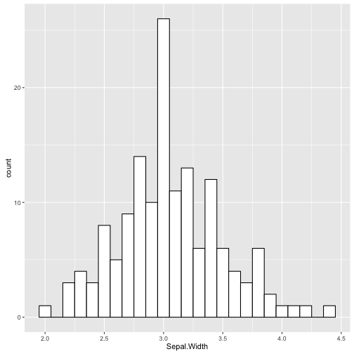
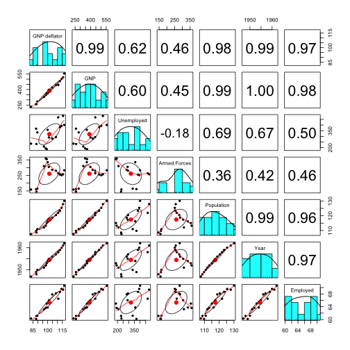

## Single and Multiple Regression

   **Jenna Blumenthal**  
   Tutorial #: 4   
   MIE 1402

---

## What is regression?

- simply put, predicting one variable from another (or > 1)
- we fit our data to some sort of model
- from this model, we can predict the outcome from any predictor data

---


```r
ggplot(longley, aes(Year, Employed)) + geom_point()
```


---


```r
ggplot(longley, aes(Year, Employed)) + geom_point() + geom_smooth(method="lm")
```



---

## Data we are using today

<style type="text/css">
table { width: 100%; font-size: 11}
</style>

```r
library(datasets)
kable(head(longley))
```


|     | GNP.deflator|     GNP| Unemployed| Armed.Forces| Population| Year| Employed|
|:----|------------:|-------:|----------:|------------:|----------:|----:|--------:|
|1947 |         83.0| 234.289|      235.6|        159.0|    107.608| 1947|   60.323|
|1948 |         88.5| 259.426|      232.5|        145.6|    108.632| 1948|   61.122|
|1949 |         88.2| 258.054|      368.2|        161.6|    109.773| 1949|   60.171|
|1950 |         89.5| 284.599|      335.1|        165.0|    110.929| 1950|   61.187|
|1951 |         96.2| 328.975|      209.9|        309.9|    112.075| 1951|   63.221|
|1952 |         98.1| 346.999|      193.2|        359.4|    113.270| 1952|   63.639|

---

## Examine the data
- missing data?


```r
na.omit(longley)
```

---

## Examine the data


```r
# data types 
str(longley)
```

```
## 'data.frame':	16 obs. of  7 variables:
##  $ GNP.deflator: num  83 88.5 88.2 89.5 96.2 ...
##  $ GNP         : num  234 259 258 285 329 ...
##  $ Unemployed  : num  236 232 368 335 210 ...
##  $ Armed.Forces: num  159 146 162 165 310 ...
##  $ Population  : num  108 109 110 111 112 ...
##  $ Year        : int  1947 1948 1949 1950 1951 1952 1953 1954 1955 1956 ...
##  $ Employed    : num  60.3 61.1 60.2 61.2 63.2 ...
```

---
## Examine the data


```r
# descriptive statistics
stat.desc(longley, basic=FALSE)
```

```
##              GNP.deflator          GNP   Unemployed Armed.Forces
## median        100.6000000  381.4270000  314.3500000  271.7500000
## mean          101.6812500  387.6984375  319.3312500  260.6687500
## SE.mean         2.6978884   24.8487344   23.3616062   17.3979901
## CI.mean.0.95    5.7504129   52.9638237   49.7940849   37.0829381
## var           116.4576250 9879.3536593 8732.2342917 4843.0409583
## std.dev        10.7915534   99.3949378   93.4464247   69.5919604
## coef.var        0.1061312    0.2563718    0.2926316    0.2669747
##                Population         Year    Employed
## median       116.80350000 1.954500e+03 65.50400000
## mean         117.42400000 1.954500e+03 65.31700000
## SE.mean        1.73902539 1.190238e+00  0.87799209
## CI.mean.0.95   3.70664488 2.536932e+00  1.87139584
## var           48.38734893 2.266667e+01 12.33392173
## std.dev        6.95610156 4.760952e+00  3.51196836
## coef.var       0.05923918 2.435893e-03  0.05376806
```

--- &two-col

***{name: left}

```r
library(psych)
pairs.panels(longley)
```



<style type="text/css">
.right {
    position: fixed;
    bottom: -500px;
    right: 0;}
</style>
***{name: right}
- bivariate scatter plots below the diagonal
- histograms on the diagonal
- Pearson correlation above the diagonal
- **also should be checking assumptions**

---
## Simple regression

- one independent variable


```r
lm.1 <- lm(Employed ~ GNP, data = longley)
summary(lm.1)
```

```
## 
## Call:
## lm(formula = Employed ~ GNP, data = longley)
## 
## Residuals:
##      Min       1Q   Median       3Q      Max 
## -0.77958 -0.55440 -0.00944  0.34361  1.44594 
## 
## Coefficients:
##              Estimate Std. Error t value Pr(>|t|)    
## (Intercept) 51.843590   0.681372   76.09  < 2e-16 ***
## GNP          0.034752   0.001706   20.37 8.36e-12 ***
## ---
## Signif. codes:  0 '***' 0.001 '**' 0.01 '*' 0.05 '.' 0.1 ' ' 1
## 
## Residual standard error: 0.6566 on 14 degrees of freedom
## Multiple R-squared:  0.9674,	Adjusted R-squared:  0.965 
## F-statistic: 415.1 on 1 and 14 DF,  p-value: 8.363e-12
```

---

## Interpreting the output

- Multiple/adjusted R squared: square of the correlation between GNP and Employment
- How well does the model explain the variance in the data?

```r
round(sqrt(0.9674), 4)
```

```
## [1] 0.9836
```

```r
round(cor(longley$GNP, longley$Employed), 4)
```

```
## [1] 0.9836
```

- tells us that GNP accounts for 98% of variation in Employment

---

## Interpreting the output

- F-statistic is significant at $p < .001$
  + tells us there is less than a 0.1% chance that an F-ratio this large would happen if the null hypothesis were true
  + GNP predicts employment significantly well

--- 

## Multiple regression


```r
lm.2 <- lm(Employed ~ GNP.deflator + GNP + Unemployed + Armed.Forces + Population + Year, data = longley) 

lm.2 <- lm(Employed ~ ., data = longley)
```

---

## Multiple regression


```r
summary(lm.2)
```

```
## 
## Call:
## lm(formula = Employed ~ ., data = longley)
## 
## Residuals:
##      Min       1Q   Median       3Q      Max 
## -0.41011 -0.15767 -0.02816  0.10155  0.45539 
## 
## Coefficients:
##                Estimate Std. Error t value Pr(>|t|)    
## (Intercept)  -3.482e+03  8.904e+02  -3.911 0.003560 ** 
## GNP.deflator  1.506e-02  8.492e-02   0.177 0.863141    
## GNP          -3.582e-02  3.349e-02  -1.070 0.312681    
## Unemployed   -2.020e-02  4.884e-03  -4.136 0.002535 ** 
## Armed.Forces -1.033e-02  2.143e-03  -4.822 0.000944 ***
## Population   -5.110e-02  2.261e-01  -0.226 0.826212    
## Year          1.829e+00  4.555e-01   4.016 0.003037 ** 
## ---
## Signif. codes:  0 '***' 0.001 '**' 0.01 '*' 0.05 '.' 0.1 ' ' 1
## 
## Residual standard error: 0.3049 on 9 degrees of freedom
## Multiple R-squared:  0.9955,	Adjusted R-squared:  0.9925 
## F-statistic: 330.3 on 6 and 9 DF,  p-value: 4.984e-10
```

- estimates of the formula ($b_{0}, b_{1}, b_{2}$...)
- confidence (probability that the estimate is wrong)

---

- Again we can look at $R^2$, $F$-ratio to understand the fit of our model
- Use standardized beta to compare predictors
  + removes issue of units
  + bigger absolute value, more important


```r
library(QuantPsyc)
```

  

```r
lm.beta(lm.2)
```

```
## GNP.deflator          GNP   Unemployed Armed.Forces   Population 
##   0.04628202  -1.01374635  -0.53754258  -0.20474069  -0.10122111 
##         Year 
##   2.47966438
```

---

## How do we decide which variables to keep, and in what order?

**Hierarchical regression**
- based on previous research
- known predictors entered into model first

**Forced entry regression**
- all at once

**Stepwise regression**
- not generally appropriate
- looks for the predictor variable that 'best' explains variance in the data
- perform cross-valdiation if you use stepwise methods

---

## Assessing the model

- If you use hierarchical regression, you can compare improvement at each stage of analysis by looking at the change in $R^2$, and testing if that change is significant using:


```r
anova(lm.1, lm.2)
```

```
## Analysis of Variance Table
## 
## Model 1: Employed ~ GNP
## Model 2: Employed ~ GNP.deflator + GNP + Unemployed + Armed.Forces + Population + 
##     Year
##   Res.Df    RSS Df Sum of Sq     F   Pr(>F)   
## 1     14 6.0361                               
## 2      9 0.8364  5    5.1997 11.19 0.001186 **
## ---
## Signif. codes:  0 '***' 0.001 '**' 0.01 '*' 0.05 '.' 0.1 ' ' 1
```

---

## Assessing the model

- case-wise diagnostics looks at individual rows (or 'cases') in the data to assess outliers, influential cases, etc


```r
rstandard(lm.2)
rstudent(lm.2)
cooks.distance(lm.2)
dfbeta(lm.2)
dffits(lm.2)
hatvalues(lm.2)
covratio(lm.2)
```

- each criterion has it's own assumptions & bounds (Andy Field, 7.9.2)

---

## Assessing the model

- no multicollinearity
- exists when there is strong correlation between predictor variables


```r
cor(longley)
```

```
##              GNP.deflator       GNP Unemployed Armed.Forces Population
## GNP.deflator    1.0000000 0.9915892  0.6206334    0.4647442  0.9791634
## GNP             0.9915892 1.0000000  0.6042609    0.4464368  0.9910901
## Unemployed      0.6206334 0.6042609  1.0000000   -0.1774206  0.6865515
## Armed.Forces    0.4647442 0.4464368 -0.1774206    1.0000000  0.3644163
## Population      0.9791634 0.9910901  0.6865515    0.3644163  1.0000000
## Year            0.9911492 0.9952735  0.6682566    0.4172451  0.9939528
## Employed        0.9708985 0.9835516  0.5024981    0.4573074  0.9603906
##                   Year  Employed
## GNP.deflator 0.9911492 0.9708985
## GNP          0.9952735 0.9835516
## Unemployed   0.6682566 0.5024981
## Armed.Forces 0.4172451 0.4573074
## Population   0.9939528 0.9603906
## Year         1.0000000 0.9713295
## Employed     0.9713295 1.0000000
```

---


```r
library(car)
```


```r
vif(lm.2) # problem if largest VIF is > 10
```

```
## GNP.deflator          GNP   Unemployed Armed.Forces   Population 
##    135.53244   1788.51348     33.61889      3.58893    399.15102 
##         Year 
##    758.98060
```

```r
mean(vif(lm.2)) # regression may be biased if substantially > 1
```

```
## [1] 519.8976
```

```r
1/vif(lm.2) # problem if tolerance < 0.1
```

```
## GNP.deflator          GNP   Unemployed Armed.Forces   Population 
## 0.0073783075 0.0005591235 0.0297451814 0.2786345641 0.0025053174 
##         Year 
## 0.0013175567
```

---

## Assessing the model


```r
plot(lm.2)
```
Plot 1: Residuals vs Fitted
- how close is the line to horizontal? (normality)
- are there outliers?

Plot 2: Q-Q plot
- how close is the line to the diagonal?

Plot 3: Standardized residuals vs fitted values
- if dots are not spread out evenly, may have violation of assumption of variance (funnel) or asummption of linearity (curve)

Plot 4: Cook distances
- identifies extreme values
- demonstrates which points have influence over model

---

## What now?

- Remove highly correlated predictors from the model


```r
longley.uncor <- subset(longley, select = c("GNP", "Unemployed", "Armed.Forces", "Employed"))
```

- Remove outliers


```r
longley.rm_outliers <- subset(longley, Year != 1951)
```

- Use Principal Components Analysis to reduce set


```r
principal(longley, 3, rotate="oblimin")
```

---


