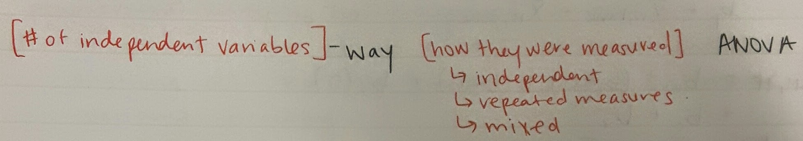

```{r include=FALSE}
library(knitr)
library(ggplot2)
```

## Comparing Several Means: ANOVA

   **Jenna Blumenthal**  
   Tutorial #: 6  
   MIE 1402

---


## ANOVA as an omnibus test
- Allows us to compare the means of three or more groups without inflating the error (see _Field_, pg 399)  

  __Eg inflating the error:__
  + Suppose we consider the safety of a drug in terms of the occurrences of different types of side effects. As more types of side effects are considered, it becomes more likely that the new drug will appear to be less safe than existing drugs in terms of at least one side effect [Wikipedia](https://en.wikipedia.org/wiki/Multiple_comparisons_problem)
  
- Produces an $F$-statistic, which compares the systematic variance to the unsystematic variance
 + "is the $explained\, variance$ $>$ $unexplained\, variance$, overall?"

---

## ANOVA as Regression
- Both just configurations of the General Linear Model (GLM)
- How well does our model (individual groupings) predict the data, compared to the error?
  + This is the same as: are our groups significantly different?
  + Regression with a categorial predictor variable

---

### Data we are using:
  + [https://studysites.sagepub.com/dsur/study/articles.htm](https://studysites.sagepub.com/dsur/study/articles.htm)

```{r include=FALSE}
data <- read.delim("Viagra.dat")
str(data$dose)
data$dose <- as.factor(data$dose)
levels(data$dose) <- c("Placebo", "Low Dose", "High Dose")
```

<style type="text/css">
.deck-container td { padding: 5px 20px}
</style>

```{r echo=FALSE}
kable(data)
```

---

## ANOVA as Regression

- Does dose (placebo, low or high) predict libido? (regression-speak)
- Can also say: is libido in these 3 groups significantly different? (ANOVA-speak)
 
```{r echo=FALSE}
ggplot(data, aes(person, libido, colour = dose)) + geom_point()
```

---

## ANOVA as Regression

- If our predictor variable (dose) has 3 ordered levels (placebo, low dose, high dose)

We can set our regression equation to:

$libido_{i} = b_{0} + b_{2high_{i}} + b_{1low_{i}} + \epsilon_{i}$

Where:

$b_0 = \overline{X}_{placebo}$  
$b_1 = \overline{X}_{low dose} - \overline{X}_{placebo}$  
$b_2 = \overline{X}_{high dose} - \overline{X}_{placebo}$   

- We are asking: Does using group means to predict libido scores perform better than using the overall mean?

---

### Try this yourself:

```{r}
lm.1 <- lm(libido ~ dose, data = data)
```

- calculate the means of each dose group
- prove to yourself that regression = ANOVA = GLM

```{r include=FALSE}
summary(lm.1)
mean(subset(data, data$dose == "Placebo")$libido)
(mean(subset(data, data$dose == "Low Dose")$libido))- (mean(subset(data, data$dose == "Placebo")$libido))
(mean(subset(data, data$dose == "High Dose")$libido))- (mean(subset(data, data$dose == "Placebo")$libido))
```

---

## ANOVA as Regression

Moral of the story: ANOVA can always be represented by the multiple regression equation in which the \# of predictor variables is one **less** than the \# of categories of the independent variable.

```{r echo=FALSE}
ggplot(data, aes(dose, libido)) + geom_boxplot()
```

---

## ANOVA in R

```{r}
viagraModel <- aov(libido ~ dose, data = data)
summary(viagraModel)
```

- First row: $SS_{M} = 20.13$ (model)
- Second row $SS_{R} = 23.60$ (error)
- $F$ value: ratio of $MS_{M}/MS_{R}$

---

## Planned contrasts
- $F$-ratio does not tell us where differences between groups lie
- Two approaches:

- __Planned contrasts:__ break down variance accounted for by the model into component parts (specific hypothesis)  

  + Not going to go into the theory today, but I highly recommend _Field_ 419-424. This is one of those times where looking through the math helps.
  
-  __Post hoc tests:__ compare every group but use a stricter acceptance criterion (no specific hypothesis)  

---

## Built-in planned contrasts in R

- R actually sets default constrasts for your grouping variable
```{r}
summary.lm(viagraModel)
```

---

- Compares each group to the base (first) group
  + Is each dose signficantly different than the placebo?
```{r}
contrasts(data$dose)
```

- If we wanted to set our own contrasts
  + e.g. is any viagra (low or high) significantly different than the placebo, and are high and low doses different from each other?

```{r}
contrast_1 <- c(-2,1,1) # placebo vs viagra
contrast_2 <- c(0,-1,1) # high vs low

contrasts(data$dose) <- cbind(contrast_1, contrast_2)
```

```{r echo=FALSE}
contrasts(data$dose)
```

---

## More complex ANOVAs



---

## More complex ANOVAs

- Benefit of using ANOVA is you can look at the effect of more than one independent variable, and how they interact
  + Main effects
  + Interaction effects

- In R:

```{r eval=FALSE}
aov_model <- aov(outcome ~ predictor1*predictor2, data = data_frame)
```

---

## References

Field A, Miles J, Field Z. Discovering Statistics Using R. London: Sage; 2012.

[https://en.wikipedia.org/wiki/Multiple_comparisons_problem](https://en.wikipedia.org/wiki/Multiple_comparisons_problem)


