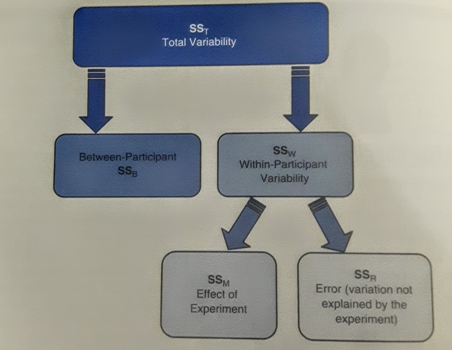

## Repeated-Measures and Mixed Design

   **Jenna Blumenthal**  
   Tutorial #: 9  
   MIE 1402

---

## Introduction

- 'Repeated-measures' - when the same entities participate in all conditions of an experiment or provide data at multiple time points
- Previously, we have looked at differences between several means when different entities contribute to different means
- BUT - the assumption of independence is now violated
  - data taken under different experimental conditions (but same entity) are likely to be related

---

## Sphericity

- Instead, we assume that the relationship between pairs of experimental conditions is similar (sphericity)
  - equality of variances of the _differences_ between treatment levels
  - you need at least 3 conditions for sphericity to be an issue (i.e. you need to test for it)

<p style="text-align: center;">$var_{A-B} \approx var_{A-C} \approx var_{B-C}$
</p>

- Can also be assessed with Mauchly's test (null hypothesis: variances between conditions are equal)

---

## Dealing with violations of sphericity
(to produce a valid $F$-ratio)

1. Apply a correction factor to the degrees of freedom in the $F$-ratio:
  - Greenhouse-Geisser correction $\hat\varepsilon$ (varies between 1 & $\frac{1}{k-1}$)
  - Hynh-Feld correction $\tilde\varepsilon$ (less conservative)

2. Use multivariate analysis of variance (MANOVA)
  - don't need assumption of sphericity
  
3. Analyse data as a multilevel model
  - regression where we can include multiple observations form the same entities

---

## Theoretical framework

- In independent ANOVA, within-participant variance is our $SS_{R}$
- In repeated measures, some of the within-participant variation comes from the effects of our experimental manipulation
- as w/ independent design, the $F$-ratio is the variation due to experimental manipulation ($SS_{M}$) vs. variation due to random factors ($SS_{R}$)



---

## Repeated-measures in R

Grab data: [http://bit.ly/2fT3QXW](http://bit.ly/2fT3QXW)


| Essay| tutor1| tutor2| tutor3| tutor4|
|-----:|------:|------:|------:|------:|
|     1|     62|     58|     63|     64|
|     2|     63|     60|     68|     65|
|     3|     65|     61|     72|     65|
|     4|     68|     64|     58|     61|
|     5|     69|     65|     54|     59|
|     6|     71|     67|     65|     50|

---

### Step 1: Format data


```r
dataLong <- melt(data, id = "Essay")
```

```
## Error in eval(expr, envir, enclos): could not find function "melt"
```

```r
kable(dataLong)
```

```
## Error in inherits(x, "list"): object 'dataLong' not found
```

---

### Step 1: Format data


```r
names(dataLong) <- c("Essay", "Tutor", "Grade")
```

```
## Error in names(dataLong) <- c("Essay", "Tutor", "Grade"): object 'dataLong' not found
```

```r
str(dataLong$Tutor)
```

```
## Error in str(dataLong$Tutor): object 'dataLong' not found
```

---

### Step 2: Exploring the data

- parametric assumptions, graph the data, etc.
- contrasts?


```r
contrasts(dataLong$Tutor)
```

```
## Error in contrasts(dataLong$Tutor): object 'dataLong' not found
```

- must be orthogonal if you want Type III sums of squares, see _Field_, 568, but we only have 1 variable

---

### Step 3: Compute ANOVA


```r
library(ez)
model.1 <- ezANOVA(dataLong, dv = .(Grade), wid = .(Essay), within = .(Tutor), detailed = TRUE)
```

```
## Error in match(x, table, nomatch = 0L): object 'dataLong' not found
```

---

### Step 4: Examine ANOVA

- 4.1 - check sphericity assumption


```
## Error in eval(expr, envir, enclos): object 'model.1' not found
```

---

### Step 5: Individual contrasts/post-hoc

- didn't really have a hypothesis so no informative contrasts


```r
pairwise.t.test(dataLong$Grade, dataLong$Tutor, paired = TRUE, p.adjust.method = "bonferroni")
```

```
## Error in factor(g): object 'dataLong' not found
```

---

## Factorial repeated-measures design

- Nothing terribly new
- More than one independent variable, add it to ` within = .(var1, var2)`
- Now we look at main effects + interaction effects
- Again check sphericity
- Break down main effects using contrasts/post-hoc tests

---

## Mixed Designs

- Includes both between groups & repeated measures
- _Field_, Ch. 14 example: what do people look for in a partner?
- Independent variables:
  - Personality
  - Looks
  - Gender

---

## Mixed Design using `ezANOVA()`

(not going through all data set-up)


